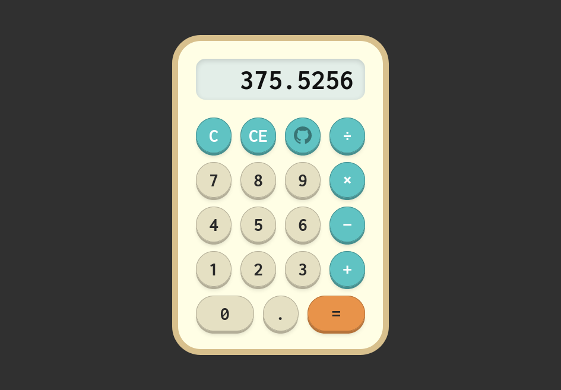

# Project: Calculator

A simple calculator written in HTML, CSS, and JS.

This is part of the [Foundations](https://theodinproject.com/courses/foundations) course in [The Odin Project](https://theodinproject.com/) curriculum.

## Project notes

- For the design, I was inspired by the pretty colors and unusual keypad layout of the [Texas Instruments TI-150](http://www.datamath.org/BASIC/DATAMATH/ti-150.htm), so I tried to combine that with the simplicity of [mini pocket calculators](https://www.google.com/search?q=mini+pocket+calculator). (Shout out to my girlfriend for giving feedback on earlier iterations of the design.)

- I got stuck on designing the front-end for a while, so I watched [Kevin Powell's video on building a calculator](https://www.youtube.com/watch?v=EuwzyB_FQNs) (only the HTML/CSS part!) where I learned about accessibility issues one should think about, like the tab order for keyboard users, and whether to set the cursor to a pointer when hovering over buttons.

- I got the idea on how to implement the calculator logic from reading about the [internal workings of the calculator](https://en.wikipedia.org/wiki/Calculator#Internal_workings) on Wikipedia. (Unexpected.)

## Feedback is welcome!

Since this project is for learning purposes, I'm not accepting PRs. Instead, feel free to [create an issue](https://github.com/joshjavier/calculator/issues/new/choose) and leave some feedback! A little point for improvement or some words of motivation can go a long way for a beginner. :)

## License

[MIT](https://choosealicense.com/licenses/mit/)
